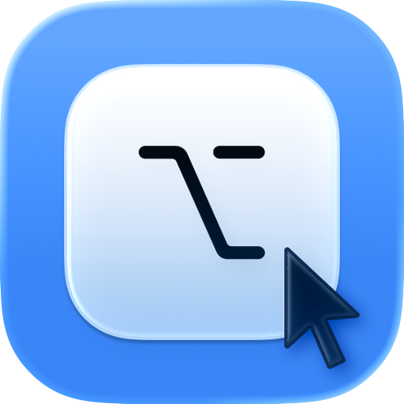

<!-- v1.3.0 -->

<h1 align="center">
    
  

  
OptClick

</h1>

<table align="center" border="0" cellpadding="0" cellspacing="0">
  <tr>
    <td align="center">
       
      <i>Useful settings items</i>
    </td>
    <td align="center">
       
      <i>Customize gobal hotkeys</i>
    </td>
  </tr>
</table>

**OptClick** is a minimal macOS app that allows you to simulate a right-click or a right-click hold by pressing the Option key.

It will be quite helpful in **gaming with a touchpad**, as it allows you to perform left and right clicks simultaneously.

## 🖱️ Usage

### General

When OptClick is enabled, press `option` to simulate a right-click, hold `option` to perform a right-click hold (e.g., for aiming).

The default global hotkey for toggling OptClick is `control + R`.

You can modify it in Settings → Shortcuts. Press `esc` while changing the hotkey to disable it.

### Auto Toggle

After enabling Auto Toggle, you can choose target apps that when they are in front, OptClick will automatically be turned on. You can add your games, for instance.

Shortcuts are available at the right of the + button, you can conveniently add Steam games, Chrome apps, CrossOver apps, Safari apps and Minecraft (it will add the process Java).

If the app is not packed as an `.app`, you can add process name. When the frontmost app has the same title as the process name designated, OptClick will be turned on.

You can still turn OptClick on when no target apps are frontmost. If you select `"Disable OptClick"` in Auto Toggle, your manual setting is temporary and will be ineffective after switching apps; if you select `"Follow last setting"`, your manual setting is persistent for all not-target apps.

You are not able to modify *launch behavior* when Auto Toggle is on, for when app launches, it will check the frontmost app to determine whether turn OptClick on.

## 📦 Installation

Requires **macOS 13.0 Ventura** or above.

1. Download the package from [Releases](https://github.com/gitmichaelqiu/OptClick/releases/)
2. Drag the app to the *Applications* folder
3. All set!

Because I do **NOT** have an Apple developer account for the app releases ~~(Apple charges an annual fee for this)~~, you may receive alerts such as "App is broken".

To resolve this, go to System Settings → the bottom of Privacy & Security → Open OptClick.

In order to simulate right clicks, OptClick will ask for Accessibility right. If you accidentally deny giving the right, go to System Settings → Privacy * Security → Accessibility → + at the bottom and select OptClick.app.

## ⚠️ Issues/Suggestions

You are welcome to create issues/suggestions in [GitHub Issues](https://github.com/gitmichaelqiu/OptClick/issues).

## 🙏 Acknowlegements

This app uses the following packages:

- [HotKey by @soffes](https://github.com/soffes/HotKey)

Thanks all these wonderful authors!

## ⭐ Support This Project

You can simply click on the **Star** to support this project for free. Thank you for your support!

